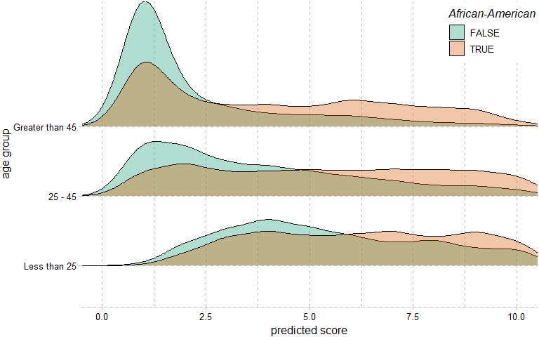
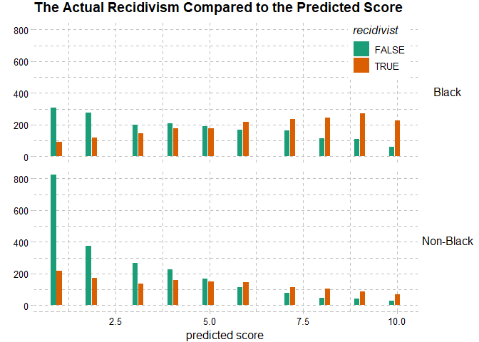
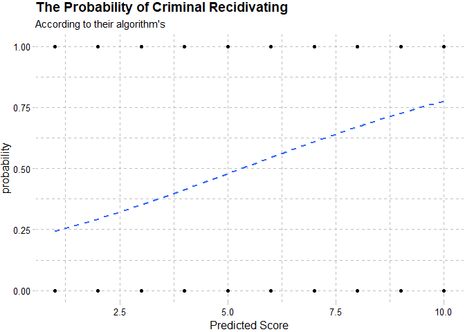
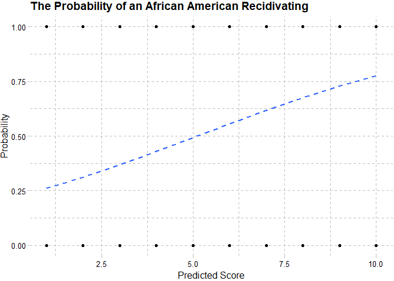

```r
################################library##############################################
library(tidyverse)
library(readr)
library(ggplot2)
library(ggridges)
library(pander)
library(caret)
################################Read File############################################
dat_o <- read.csv('https://raw.githubusercontent.com/propublica/compas-analysis/master/compas-scores-two-years.csv')
dat <- read_csv('dt_dat.csv')
dat_nnn <- read_csv('race.csv')
```

  

### Team Info
1. Team members: 
  Keaton Sant, Keith Tung, Juheon Song
2. Data source:
  Data source: Machine bias https://github.com/propublica/compas-analysis/blob/master/compas-scores-two-years.csv
    
# Introduction  
###    The source  
This project is mainly inspired by a statistical study online; in this study, the narrator introduces the reader to an algorithm the justice system in the US is currently using. This algorithm takes in information of a criminal, for instance, age, gender, race, and criminal records, then produces a score for the person’s ‘risk of recidivism’ which would be provided as reference to the judge in deciding the sentence of a criminal; the study contains paragraphs of argument, various plots and charts that surround the same claim : the algorithm is biased against black criminal.     

###     Our take  

We, as a team, chose to investigate this data that recorded inmates’ information that was used to predict recidivism rate before they were sentenced jail time. This data set shows a column with the predicted score and whether these individuals ended up committing a crime again in the 2 years period after they were released from jail.   

###    Our Goals  
There are two main goals for our project:  

*	Examine the claim made by the study, see that the current algorithm is biased
*	Try to create an algorithm hoping to see if race is indeed a helpful variable in predicting recidivism rate.
  
#  Data Preparation  
###    Understanding the data  
Fortunately, the study provided the data we need, and we were able to get our hands on a fairly clean dataset. The data consist of 53 columns and 10 observation.  
  
  
There are a few observations from the data.   
  

### Observation{.tabset}  
#### The converting
To accomplish our tasks, we needed the data to fit in four different machine learning algorithms, namely, Naïve Baynes (classifier), Decision tree (classifier), Neutral network classification, and lastly neutral network regression for the ensemble part. The data set contains numeric, categorical and nominal columns, with and binary target (recidivist or non-recidivist); we decided that we would have to convert our data to fit our models.   

#### Original data(sample of 5)

```r
dat_o %>% head(5) %>% print.data.frame()
```

```
##   id               name  first        last compas_screening_date  sex
## 1  1   miguel hernandez miguel   hernandez            2013-08-14 Male
## 2  3        kevon dixon  kevon       dixon            2013-01-27 Male
## 3  4           ed philo     ed       philo            2013-04-14 Male
## 4  5        marcu brown  marcu       brown            2013-01-13 Male
## 5  6 bouthy pierrelouis bouthy pierrelouis            2013-03-26 Male
##          dob age         age_cat             race juv_fel_count
## 1 1947-04-18  69 Greater than 45            Other             0
## 2 1982-01-22  34         25 - 45 African-American             0
## 3 1991-05-14  24    Less than 25 African-American             0
## 4 1993-01-21  23    Less than 25 African-American             0
## 5 1973-01-22  43         25 - 45            Other             0
##   decile_score juv_misd_count juv_other_count priors_count
## 1            1              0               0            0
## 2            3              0               0            0
## 3            4              0               1            4
## 4            8              1               0            1
## 5            1              0               0            2
##   days_b_screening_arrest           c_jail_in          c_jail_out
## 1                      -1 2013-08-13 06:03:42 2013-08-14 05:41:20
## 2                      -1 2013-01-26 03:45:27 2013-02-05 05:36:53
## 3                      -1 2013-04-13 04:58:34 2013-04-14 07:02:04
## 4                      NA                                        
## 5                      NA                                        
##   c_case_number c_offense_date c_arrest_date c_days_from_compas
## 1 13011352CF10A     2013-08-13                                1
## 2 13001275CF10A     2013-01-26                                1
## 3 13005330CF10A     2013-04-13                                1
## 4 13000570CF10A     2013-01-12                                1
## 5 12014130CF10A                   2013-01-09                 76
##   c_charge_degree                  c_charge_desc is_recid r_case_number
## 1               F   Aggravated Assault w/Firearm        0              
## 2               F Felony Battery w/Prior Convict        1 13009779CF10A
## 3               F          Possession of Cocaine        1 13011511MM10A
## 4               F         Possession of Cannabis        0              
## 5               F          arrest case no charge        0              
##   r_charge_degree r_days_from_arrest r_offense_date
## 1                                 NA               
## 2            (F3)                 NA     2013-07-05
## 3            (M1)                  0     2013-06-16
## 4                                 NA               
## 5                                 NA               
##                 r_charge_desc  r_jail_in r_jail_out violent_recid
## 1                                                              NA
## 2 Felony Battery (Dom Strang)                                  NA
## 3 Driving Under The Influence 2013-06-16 2013-06-16            NA
## 4                                                              NA
## 5                                                              NA
##   is_violent_recid vr_case_number vr_charge_degree vr_offense_date
## 1                0                                                
## 2                1  13009779CF10A             (F3)      2013-07-05
## 3                0                                                
## 4                0                                                
## 5                0                                                
##                vr_charge_desc type_of_assessment decile_score.1 score_text
## 1                             Risk of Recidivism              1        Low
## 2 Felony Battery (Dom Strang) Risk of Recidivism              3        Low
## 3                             Risk of Recidivism              4        Low
## 4                             Risk of Recidivism              8       High
## 5                             Risk of Recidivism              1        Low
##   screening_date v_type_of_assessment v_decile_score v_score_text
## 1     2013-08-14     Risk of Violence              1          Low
## 2     2013-01-27     Risk of Violence              1          Low
## 3     2013-04-14     Risk of Violence              3          Low
## 4     2013-01-13     Risk of Violence              6       Medium
## 5     2013-03-26     Risk of Violence              1          Low
##   v_screening_date in_custody out_custody priors_count.1 start  end event
## 1       2013-08-14 2014-07-07  2014-07-14              0     0  327     0
## 2       2013-01-27 2013-01-26  2013-02-05              0     9  159     1
## 3       2013-04-14 2013-06-16  2013-06-16              4     0   63     0
## 4       2013-01-13                                     1     0 1174     0
## 5       2013-03-26                                     2     0 1102     0
##   two_year_recid
## 1              0
## 2              1
## 3              1
## 4              0
## 5              0
```
#### Data after wrangling(decision tree)

```r
dat %>% head(5) %>% print.data.frame()
```

```
##    sex         age_cat  race juv_fel_count juv_misd_count juv_other_count
## 1 Male Greater than 45 FALSE          None           None            None
## 2 Male         25 - 45  TRUE          None           None            None
## 3 Male    Less than 25  TRUE          None           None          1 to 2
## 4 Male    Less than 25  TRUE          None         1 to 2            None
## 5 Male         25 - 45 FALSE          None           None            None
##   priors_count c_charge_degree                  c_charge_desc
## 1         None               F   Aggravated Assault w/Firearm
## 2         None               F Felony Battery w/Prior Convict
## 3       1 to 5               F          Possession of Cocaine
## 4       1 to 5               F         Possession of Cannabis
## 5       1 to 5               F          arrest case no charge
##   two_year_recid
## 1              0
## 2              1
## 3              1
## 4              0
## 5              0
```
#### Data after wrangleing(Neutral Network and Naïve Baynes)

```r
dat_nnn %>% head(5) %>% print.data.frame()
```

```
##   sex age race juv_fel_count juv_misd_count juv_other_count priors_count
## 1   1  69    1             0              0               0            0
## 2   1  34    0             0              0               0            0
## 3   1  24    0             0              0               1            4
## 4   1  23    0             0              1               0            1
## 5   1  43    1             0              0               0            2
##   c_charge_degree c_charge_desc two_year_recid
## 1               0             1              0
## 2               0             2              1
## 3               0             3              1
## 4               0             4              0
## 5               0             5              0
```

###    Decisions made{.tabset}  
#### Charges
One of the challenges of the data is the c_charge_desc that stores the description of the crime for what the inmate was charged; there were 437 different charges description in our data with over 7000 observations. We had to do a local encoding for each of them for the neural network models.    

#### List of charges  

```r
dat_o$c_charge_desc %>% 
  unique() 
```

```
##   [1] Aggravated Assault w/Firearm                        
##   [2] Felony Battery w/Prior Convict                      
##   [3] Possession of Cocaine                               
##   [4] Possession of Cannabis                              
##   [5] arrest case no charge                               
##   [6] Battery                                             
##   [7] Possession Burglary Tools                           
##   [8] Insurance Fraud                                     
##   [9] Poss 3,4 MDMA (Ecstasy)                             
##  [10] Poss3,4 Methylenedioxymethcath                      
##  [11] Felony Driving While Lic Suspd                      
##  [12] Grand Theft in the 3rd Degree                       
##  [13] Driving While License Revoked                       
##  [14] Possession Of Heroin                                
##  [15] Battery on Law Enforc Officer                       
##  [16] Possession Of Methamphetamine                       
##  [17] Introduce Contraband Into Jail                      
##  [18] Lewd/Lasc Battery Pers 12+/<16                      
##  [19] Susp Drivers Lic 1st Offense                        
##  [20] Carrying Concealed Firearm                          
##  [21] Pos Cannabis W/Intent Sel/Del                       
##  [22] Tampering With Physical Evidence                    
##  [23] Att Tamper w/Physical Evidence                      
##  [24] Agg Fleeing and Eluding                             
##  [25] Operating W/O Valid License                         
##  [26] Poss Wep Conv Felon                                 
##  [27] Possess Cannabis/20 Grams Or Less                   
##  [28] Unlaw Use False Name/Identity                       
##  [29] Viol Injunct Domestic Violence                      
##  [30] Defrauding Innkeeper $300/More                      
##  [31] Uttering a Forged Instrument                        
##  [32] DUI Level 0.15 Or Minor In Veh                      
##  [33] Driving License Suspended                           
##  [34] Possession of Oxycodone                             
##  [35] Attempt Armed Burglary Dwell                        
##  [36] Poss Tetrahydrocannabinols                          
##  [37] Possess Drug Paraphernalia                          
##  [38] Poss Firearm W/Altered ID#                          
##  [39] Sell Conterfeit Cont Substance                      
##  [40] Unlaw LicTag/Sticker Attach                         
##  [41] Aggravated Battery / Pregnant                       
##  [42] Burglary Structure Unoccup                          
##  [43] False Name By Person Arrest                         
##  [44] Poss Cocaine/Intent To Del/Sel                      
##  [45] Burglary Dwelling Assault/Batt                      
##  [46] Felony Battery (Dom Strang)                         
##  [47] Attempted Burg/struct/unocc                         
##  [48] Deliver Cocaine                                     
##  [49] Possession Of Alprazolam                            
##  [50] Flee/Elude LEO-Agg Flee Unsafe                      
##  [51] Fail To Redeliv Hire/Leas Prop                      
##  [52] Aggravated Assault W/Dead Weap                      
##  [53] False Ownership Info/Pawn Item                      
##  [54] Possession of Morphine                              
##  [55] Poss Contr Subst W/o Prescript                      
##  [56] Aggrav Stalking After Injunctn                      
##  [57] Crim Use of Personal ID Info                        
##  [58] Resist/Obstruct W/O Violence                        
##  [59] Petit Theft                                         
##  [60] Disorderly Intoxication                             
##  [61] Lewdness Violation                                  
##  [62] Poss Pyrrolidinovalerophenone                       
##  [63] Assault                                             
##  [64] Fail To Obey Police Officer                         
##  [65] Solicit Purchase Cocaine                            
##  [66] Felony Petit Theft                                  
##  [67] Grand Theft in the 1st Degree                       
##  [68] Driving Under The Influence                         
##  [69]                                                     
##  [70] Possession Of Carisoprodol                          
##  [71] Burglary Conveyance Assault/Bat                     
##  [72] Deliver 3,4 Methylenediox                           
##  [73] Aggravated Assault W/dead Weap                      
##  [74] Leave Acc/Attend Veh/More $50                       
##  [75] Burglary Unoccupied Dwelling                        
##  [76] Child Abuse                                         
##  [77] Agg Battery Grt/Bod/Harm                            
##  [78] Lewd or Lascivious Molestation                      
##  [79] Sexual Performance by a Child                       
##  [80] Leaving Acc/Unattended Veh                          
##  [81] Fleeing Or Attmp Eluding A Leo                      
##  [82] Criminal Mischief                                   
##  [83] Aggrav Battery w/Deadly Weapon                      
##  [84] Trespass Struct/Conveyance                          
##  [85] DUI Property Damage/Injury                          
##  [86] Aggravated Battery (Firearm/Actual Possession)      
##  [87] Robbery / No Weapon                                 
##  [88] Grand Theft (Motor Vehicle)                         
##  [89] Robbery / Weapon                                    
##  [90] Burglary With Assault/battery                       
##  [91] Voyeurism                                           
##  [92] False Imprisonment                                  
##  [93] Prowling/Loitering                                  
##  [94] Viol Prot Injunc Repeat Viol                        
##  [95] Throw In Occupied Dwell                             
##  [96] Burglary Conveyance Unoccup                         
##  [97] Unauth Poss ID Card or DL                           
##  [98] Opert With Susp DL 2nd Offens                       
##  [99] Failure To Return Hired Vehicle                     
## [100] Agg Fleeing/Eluding High Speed                      
## [101] Attempted Robbery  No Weapon                        
## [102] Resist Officer w/Violence                           
## [103] Battery On Parking Enfor Speci                      
## [104] Corrupt Public Servant                              
## [105] Robbery Sudd Snatch No Weapon                       
## [106] Forging Bank Bills/Promis Note                      
## [107] Felony/Driving Under Influence                      
## [108] Tamper With Witness/Victim/CI                       
## [109] Throw Deadly Missile Into Veh                       
## [110] Exposes Culpable Negligence                         
## [111] Use Scanning Device to Defraud                      
## [112] Leaving the Scene of Accident                       
## [113] Crimin Mischief Damage $1000+                       
## [114] Fleeing or Eluding a LEO                            
## [115] Possession of Ethylone                              
## [116] Aggravated Battery                                  
## [117] Felony DUI (level 3)                                
## [118] Fraudulent Use of Credit Card                       
## [119] Drivg While Lic Suspd/Revk/Can                      
## [120] Burglary Dwelling Occupied                          
## [121] Cash Item w/Intent to Defraud                       
## [122] False Bomb Report                                   
## [123] Leave Accd/Attend Veh/Less $50                      
## [124] Fail Register Vehicle                               
## [125] Trespassing/Construction Site                       
## [126] Reckless Driving                                    
## [127] Consp Traff Oxycodone 28g><30k                      
## [128] Unemployment Compensatn Fraud                       
## [129] Sexual Battery / Vict 12 Yrs +                      
## [130] Neglect Child / No Bodily Harm                      
## [131] Criminal Mischief Damage <$200                      
## [132] Aggravated Assault                                  
## [133] Disorderly Conduct                                  
## [134] Viol Pretrial Release Dom Viol                      
## [135] Petit Theft $100- $300                              
## [136] Att Burgl Unoccupied Dwel                           
## [137] Grand Theft Firearm                                 
## [138] Failure To Pay Taxi Cab Charge                      
## [139] Burglary Conveyance Occupied                        
## [140] Manslaughter W/Weapon/Firearm                       
## [141] Arson II (Vehicle)                                  
## [142] Violation of Injunction Order/Stalking/Cyberstalking
## [143] Obstruct Fire Equipment                             
## [144] Deliver Alprazolam                                  
## [145] Manufacture Cannabis                                
## [146] Attempted Robbery Firearm                           
## [147] Fail To Secure Load                                 
## [148] Battery on a Person Over 65                         
## [149] Felony Battery                                      
## [150] Fel Drive License Perm Revoke                       
## [151] Deliver Cannabis                                    
## [152] Deliver Cocaine 1000FT Church                       
## [153] Possession of Hydromorphone                         
## [154] Simulation of Legal Process                         
## [155] Defrauding Innkeeper                                
## [156] Grand Theft of a Fire Extinquisher                  
## [157] Fighting/Baiting Animals                            
## [158] Att Burgl Conv Occp                                 
## [159] Depriv LEO of Protect/Communic                      
## [160] Delivery of 5-Fluoro PB-22                          
## [161] Open Carrying Of Weapon                             
## [162] Pos Cannabis For Consideration                      
## [163] Uttering Forged Bills                               
## [164] Expired DL More Than 6 Months                       
## [165] Stalking                                            
## [166] Trespass Structure/Conveyance                       
## [167] DUI - Enhanced                                      
## [168] Sex Offender Fail Comply W/Law                      
## [169] Battery Emergency Care Provide                      
## [170] Sale/Del Counterfeit Cont Subs                      
## [171] Possession Child Pornography                        
## [172] Lve/Scen/Acc/Veh/Prop/Damage                        
## [173] Sex Battery Deft 18+/Vict 11-                       
## [174] Posses/Disply Susp/Revk/Frd DL                      
## [175] DUI Blood Alcohol Above 0.20                        
## [176] Burglary Conveyance Armed                           
## [177] Crim Attempt/Solicit/Consp                          
## [178] License Suspended Revoked                           
## [179] Live on Earnings of Prostitute                      
## [180] Robbery W/Firearm                                   
## [181] Money Launder 100K or More Dols                     
## [182] Aggravated Assault W/o Firearm                      
## [183] Poss Unlaw Issue Driver Licenc                      
## [184] Theft/To Deprive                                    
## [185] Retail Theft $300 1st Offense                       
## [186] Intoxicated/Safety Of Another                       
## [187] Gambling/Gamb Paraphernalia                         
## [188] Neglect/Abuse Elderly Person                        
## [189] Traffick Amphetamine 28g><200g                      
## [190] Grand Theft In The 3Rd Degree                       
## [191] Poss Of Controlled Substance                        
## [192] Del of JWH-250 2-Methox 1-Pentyl                    
## [193] Purchasing Of Alprazolam                            
## [194] Unauthorized Interf w/Railroad                      
## [195] Possession Of Lorazepam                             
## [196] Restraining Order Dating Viol                       
## [197] Solic to Commit Battery                             
## [198] Carjacking with a Firearm                           
## [199] Culpable Negligence                                 
## [200] Criminal Mischief>$200<$1000                        
## [201] Delivery of Heroin                                  
## [202] DUI - Property Damage/Personal Injury               
## [203] Exploit Elderly Person 20-100K                      
## [204] Poss of Methylethcathinone                          
## [205] Possession Of Buprenorphine                         
## [206] Tresspass Struct/Conveyance                         
## [207] Poss Alprazolam W/int Sell/Del                      
## [208] Offer Agree Secure For Lewd Act                     
## [209] Prostitution/Lewdness/Assign                        
## [210] Neglect Child / Bodily Harm                         
## [211] Trespass Structure w/Dang Weap                      
## [212] Possession of Benzylpiperazine                      
## [213] Cruelty Toward Child                                
## [214] Prostitution/Lewd Act Assignation                   
## [215] Grand Theft Dwell Property                          
## [216] Sound Articles Over 100                             
## [217] Burgl Dwel/Struct/Convey Armed                      
## [218] Ride Tri-Rail Without Paying                        
## [219] Disrupting School Function                          
## [220] Strong Armed  Robbery                               
## [221] Poss Trifluoromethylphenylpipe                      
## [222] Felony Batt(Great Bodily Harm)                      
## [223] Carry Open/Uncov Bev In Pub                         
## [224] Possession of Hydrocodone                           
## [225] Agg Assault Law Enforc Officer                      
## [226] Agg Assault W/int Com Fel Dome                      
## [227] Poss Cntrft Contr Sub w/Intent                      
## [228] Counterfeit Lic Plates/Sticker                      
## [229] Possession of Butylone                              
## [230] Sale/Del Cannabis At/Near Scho                      
## [231] Poss of Firearm by Convic Felo                      
## [232] Refuse to Supply DNA Sample                         
## [233] Stalking (Aggravated)                               
## [234] Sel/Pur/Mfr/Del Control Substa                      
## [235] Poss Drugs W/O A Prescription                       
## [236] Poss of Cocaine W/I/D/S 1000FT Park                 
## [237] Lewd Act Presence Child 16-                         
## [238] Soliciting For Prostitution                         
## [239] Extradition/Defendants                              
## [240] Refuse Submit Blood/Breath Test                     
## [241] Trespass Other Struct/Conve                         
## [242] Solicit Deliver Cocaine                             
## [243] Attempt Burglary (Struct)                           
## [244] Felon in Pos of Firearm or Amm                      
## [245] Burglary Dwelling Armed                             
## [246] DWI w/Inj Susp Lic / Habit Off                      
## [247] DUI- Enhanced                                       
## [248] Violation License Restrictions                      
## [249] Aggr Child Abuse-Torture,Punish                     
## [250] Purchase Cannabis                                   
## [251] Use of Anti-Shoplifting Device                      
## [252] Possess Countrfeit Credit Card                      
## [253] Robbery W/Deadly Weapon                             
## [254] Poss Counterfeit Payment Inst                       
## [255] D.U.I. Serious Bodily Injury                        
## [256] Poss Anti-Shoplifting Device                        
## [257] Threat Public Servant                               
## [258] Use Of 2 Way Device To Fac Fel                      
## [259] Escape                                              
## [260] DUI/Property Damage/Persnl Inj                      
## [261] Hiring with Intent to Defraud                       
## [262] Carrying A Concealed Weapon                         
## [263] Solicitation On Felony 3 Deg                        
## [264] Video Voyeur-<24Y on Child >16                      
## [265] Sell or Offer for Sale Counterfeit Goods            
## [266] Throw Missile Into Pub/Priv Dw                      
## [267] Crim Use Of Personal Id Info                        
## [268] Possession Of Diazepam                              
## [269] Burglary Structure Assault/Batt                     
## [270] Shoot In Occupied Dwell                             
## [271] Battery On A Person Over 65                         
## [272] Fail To Redeliver Hire Prop                         
## [273] Unl/Disturb Education/Instui                        
## [274] Violation Of Boater Safety Id                       
## [275] False Motor Veh Insurance Card                      
## [276] DWLS Susp/Cancel Revoked                            
## [277] Viol Injunction Protect Dom Vi                      
## [278] Aggrav Child Abuse-Agg Battery                      
## [279] Deliver Cocaine 1000FT Store                        
## [280] Aggravated Battery On 65/Older                      
## [281] Possess/Use Weapon 1 Deg Felon                      
## [282] Fail Obey Driv Lic Restrictions                     
## [283] Carjacking w/o Deadly Weapon                        
## [284] Contribute Delinquency Of A Minor                   
## [285] Aggrav Child Abuse-Causes Harm                      
## [286] Imperson Public Officer or Emplyee                  
## [287] Possession of Codeine                               
## [288] Tamper With Victim                                  
## [289] Abuse Without Great Harm                            
## [290] Compulsory Sch Attnd Violation                      
## [291] Battery On Fire Fighter                             
## [292] Oper Motorcycle W/O Valid DL                        
## [293] Aiding Escape                                       
## [294] Traffick Hydrocodone   4g><14g                      
## [295] Poss/Sell/Del Cocaine 1000FT Sch                    
## [296] Poss/pur/sell/deliver Cocaine                       
## [297] Del Morphine at/near Park                           
## [298] Giving False Crime Report                           
## [299] Felony Committing Prostitution                      
## [300] Possess Tobacco Product Under 18                    
## [301] Murder in the First Degree                          
## [302] Use Computer for Child Exploit                      
## [303] Traff In Cocaine <400g>150 Kil                      
## [304] Murder In 2nd Degree W/firearm                      
## [305] Grand Theft (motor Vehicle)                         
## [306] Poss Meth/Diox/Meth/Amp (MDMA)                      
## [307] Trans/Harm/Material to a Minor                      
## [308] Harass Witness/Victm/Informnt                       
## [309] Grand Theft of the 2nd Degree                       
## [310] Possession Of Phentermine                           
## [311] Poss Of RX Without RX                               
## [312] Interference with Custody                           
## [313] Traffic Counterfeit Cred Cards                      
## [314] Possession Of 3,4Methylenediox                      
## [315] Crlty Twrd Child Urge Oth Act                       
## [316] Dealing in Stolen Property                          
## [317] Obtain Control Substance By Fraud                   
## [318] Tampering with a Victim                             
## [319] Poss Pyrrolidinovalerophenone W/I/D/S               
## [320] Solicit To Deliver Cocaine                          
## [321] Pos Methylenedioxymethcath W/I/D/S                  
## [322] Offn Against Intellectual Prop                      
## [323] Poss Of 1,4-Butanediol                              
## [324] Poss F/Arm Delinq                                   
## [325] Poss/Sell/Deliver Clonazepam                        
## [326] Attempted Robbery  Weapon                           
## [327] Traffick Oxycodone     4g><14g                      
## [328] Interfere W/Traf Cont Dev RR                        
## [329] Tresspass in Structure or Conveyance                
## [330] Attempted Burg/Convey/Unocc                         
## [331] Att Burgl Struc/Conv Dwel/Occp                      
## [332] Murder in 2nd Degree                                
## [333] Fabricating Physical Evidence                       
## [334] DOC/Cause Public Danger                             
## [335] Fail Sex Offend Report Bylaw                        
## [336] Contradict Statement                                
## [337] Unlaw Lic Use/Disply Of Others                      
## [338] Del 3,4 Methylenedioxymethcath                      
## [339] Possession Of Amphetamine                           
## [340] Discharge Firearm From Vehicle                      
## [341] Lease For Purpose Trafficking                       
## [342] Lewd/Lasciv Molest Elder Persn                      
## [343] Opert With Susp DL 2ND Offense                      
## [344] Del Cannabis At/Near Park                           
## [345] Burglary Assault/Battery Armed                      
## [346] DWLS Canceled Disqul 1st Off                        
## [347] Bribery Athletic Contests                           
## [348] Grand Theft on 65 Yr or Older                       
## [349] Crim Attempt/Solic/Consp                            
## [350] Poss/Sell/Del/Man Amobarbital                       
## [351] Kidnapping / Domestic Violence                      
## [352] Cruelty to Animals                                  
## [353] Trespass Private Property                           
## [354] Unauth C/P/S Sounds>1000/Audio                      
## [355] Obstruct Officer W/Violence                         
## [356] Cause Anoth Phone Ring Repeat                       
## [357] Poss Unlaw Issue Id                                 
## [358] PL/Unlaw Use Credit Card                            
## [359] Possession of LSD                                   
## [360] Tamper With Witness                                 
## [361] Possession Of Cocaine                               
## [362] Harm Public Servant Or Family                       
## [363] Possess Cannabis 1000FTSch                          
## [364] Consp Traff Oxycodone  4g><14g                      
## [365] Consume Alcoholic Bev Pub                           
## [366] Shoot Into Vehicle                                  
## [367] Battery Spouse Or Girlfriend                        
## [368] Delivery Of Drug Paraphernalia                      
## [369] Theft                                               
## [370] Misuse Of 911 Or E911 System                        
## [371] Uttering Forged Credit Card                         
## [372] Retail Theft $300 2nd Offense                       
## [373] Agg Abuse Elderlly/Disabled Adult                   
## [374] Accessory After the Fact                            
## [375] Prostitution                                        
## [376] Poss Similitude of Drivers Lic                      
## [377] Present Proof of Invalid Insur                      
## [378] Structuring Transactions                            
## [379] Principal In The First Degree                       
## [380] Assault Law Enforcement Officer                     
## [381] Possession Of Fentanyl                              
## [382] Del Cannabis For Consideration                      
## [383] Possess w/I/Utter Forged Bills                      
## [384] False Info LEO During Invest                        
## [385] Possess Mot Veh W/Alt Vin #                         
## [386] Littering                                           
## [387] Possession Of Paraphernalia                         
## [388] Criminal Attempt 3rd Deg Felon                      
## [389] Possess Weapon On School Prop                       
## [390] Possession of Alcohol Under 21                      
## [391] Unlicensed Telemarketing                            
## [392] Issuing a Worthless Draft                           
## [393] Conspiracy to Deliver Cocaine                       
## [394] Fraud Obtain Food or Lodging                        
## [395] Aide/Abet Prostitution Lewdness                     
## [396] Arson in the First Degree                           
## [397] Possession Firearm School Prop                      
## [398] Falsely Impersonating Officer                       
## [399] Poss Oxycodone W/Int/Sell/Del                       
## [400] Poss of Vessel w/Altered ID NO                      
## [401] Poss Pyrrolidinobutiophenone                        
## [402] Conspiracy Dealing Stolen Prop                      
## [403] Felony DUI - Enhanced                               
## [404] Aggravated Battery (Firearm)                        
## [405] False 911 Call                                      
## [406] Computer Pornography                                
## [407] Trespass Property w/Dang Weap                       
## [408] Aggress/Panhandle/Beg/Solict                        
## [409] Sell/Man/Del Pos/w/int Heroin                       
## [410] Purchase/P/W/Int Cannabis                           
## [411] Uttering Worthless Check +$150                      
## [412] Deliver Cannabis 1000FTSch                          
## [413] Unlawful Conveyance of Fuel                         
## [414] Fail Register Career Offender                       
## [415] Lewd/Lasc Exhib Presence <16yr                      
## [416] Armed Trafficking in Cannabis                       
## [417] Dealing In Stolen Property                          
## [418] Trespass On School Grounds                          
## [419] Offer Agree Secure/Lewd Act                         
## [420] Sex Batt Faml/Cust Vict 12-17Y                      
## [421] Possession of Methadone                             
## [422] Possession Of Clonazepam                            
## [423] Trespass Struct/Convey Occupy                       
## [424] Sell Cannabis                                       
## [425] Compulsory Attendance Violation                     
## [426] Possess Controlled Substance                        
## [427] Unlawful Use Of Police Badges                       
## [428] Manage Busn W/O City Occup Lic                      
## [429] Deliver Cocaine 1000FT School                       
## [430] Sel Etc/Pos/w/Int Contrft Schd                      
## [431] Possession Of Anabolic Steroid                      
## [432] Exhibition Weapon School Prop                       
## [433] Purchase Of Cocaine                                 
## [434] Deliver Cocaine 1000FT Park                         
## [435] Burglary Structure Occupied                         
## [436] Alcoholic Beverage Violation-FL                     
## [437] Attempted Deliv Control Subst                       
## [438] Possession of XLR11                                 
## 438 Levels:  Abuse Without Great Harm ... Voyeurism
```
#### Race   
Since one of our goals is to see if the algorithm is biased againest African Americans crimnals, we simply convert all the non-black race to 0, black to 1 (basically a column to 'Isblack'). 


# Mining/learning from the data


### Data analysis{.tabset}  
#### 1  
The graph shows the density ofthe predicted score from the algorithm. We can see a that in all three age groups, african-americans has a higher density beyond the 5.0 in score; with non-african-american criminals having distrabutions closing to the other end. It also shows the differences among the age group, while the algorithm is fairly willing to give a low score to someone in the 'Greater than 45' group; it tends to give a higher score to people that are in the less than 25 more than the other two. 

```r
dat_o %>% 
  mutate(age_cat = fct_relevel(age_cat, 
                               c('Less than 25',
                                 '25 - 45',
                                 'Greater than 45'))) %>% 
  ggplot() +
  aes(y = age_cat, 
      x = dat_o$decile_score.1, 
      fill = (race == 'African-American')) +
  geom_density_ridges(panel_scaling = F,
                       alpha = 0.35) +
  coord_cartesian(xlim = c(0,10)) +
  scale_fill_brewer(palette = 'Dark2') +
  ggthemes::theme_pander() +
  labs(x = 'predicted score',
       y = 'age group') +
  guides(fill = guide_legend(title = 'African-American', label.position = 'right')) +
  theme(axis.line.x = element_line(linetype = 'dashed', colour = 'Gray'),
        legend.position = c(0.9,0.9))
```

<!-- -->

#### 2  

```r
dat_o %>% 
  ggplot() +
  aes(x = dat_o$decile_score.1, fill = dat_o$two_year_recid== 1) +
  geom_histogram(position = 'dodge_2') +
  facet_grid(race == 'African-American'~.) +
  ggthemes::theme_pander() +
  theme(strip.text.y = element_text(size = 8, angle = 0),
        strip.background = element_blank()) +
  scale_fill_brewer(palette = 'Dark2') +
  guides(fill = guide_legend(title = 'recidivist', label.position = 'right')) +
  labs(x = 'predicted score', y = '') +
  theme(axis.line.x = element_line(linetype = 'dashed', colour = 'Gray'),
        legend.position = c(0.9,0.9)) 
```

<!-- -->

#### 3

```r
dat_o %>% 
  ggplot() +
  aes(y = as.numeric(dat_o$two_year_recid), x = dat_o$decile_score.1) +
  geom_smooth(method = 'glm', method.args = list(family = 'binomial'), se = F, linetype = 'dashed') +
  geom_point() +
  ggthemes::theme_pander() +
  labs(y = 'probability', x = 'mpg')
```

<!-- -->

```r
dat_o %>% 
  filter(race == 'African-American') %>% 
  ggplot() +
  aes(y = as.numeric(two_year_recid), x = decile_score.1) +
  geom_smooth(method = 'glm', method.args = list(family = 'binomial'), se = F, linetype = 'dashed') +
  geom_point() +
  ggthemes::theme_pander() +
  labs(y = 'probability', x = 'mpg')
```

<!-- -->

###    The planning  
We mainly used three algorithms for this project, decision tree, neural network, and naïve Baynes. Since we are trying to compare the given predicted score to ours, we were convinced that a regression is best for the task at hand, since the predicted scores are in a scale of 1 to 10. 1 being the inmates will not likely to commit crime in the future and 10 being very likely, our algorithms would suggest a number between 1 and 10 for the predicted, then we would find out how close/far the score is to the target (1 = 10, 0 = 0) compared with the given scores. We also wanted to see if the algorithm is discriminating against each group of people by their colour of skin. A way to find that out is to see the ratio of (false positive) type I error in the non-African-American cases and  African-American cases.  

###    Setting up the environment  
When we were trying the different algorithms, we would run our models in two environments, one with race given as the training data, the other one without race given. We would like to find out how important the race feature is. This means before the ensemble learning, we had 6 different models to building first.  

# Results{.tabset}  
## Accuracy
Accuracy is one the way to assess the race variable is in fact helping in a significant way when used to predict a person's recidivism rate.
  
Algorithm|With race | Without race
---------|----------|-------------
Decision tree|45.6%|44.0%
Neutral network|66%|65%  
Naïve Baynes|61.8%|55.7%  
Ensemble|?|?    
## Confusion Matrix  

```r
x <- dat_o %>% 
  select(race, two_year_recid, decile_score.1) %>% 
  mutate(highlow = case_when(decile_score.1 > 5 ~ 1,
                             T                  ~ 0)) 
p_class <- factor(x$highlow)
class_levels <- factor(x$two_year_recid)

confusionMatrix(p_class, class_levels)
```

```
## Confusion Matrix and Statistics
## 
##           Reference
## Prediction    0    1
##          0 3036 1542
##          1  927 1709
##                                           
##                Accuracy : 0.6577          
##                  95% CI : (0.6467, 0.6687)
##     No Information Rate : 0.5493          
##     P-Value [Acc > NIR] : < 2.2e-16       
##                                           
##                   Kappa : 0.2968          
##                                           
##  Mcnemar's Test P-Value : < 2.2e-16       
##                                           
##             Sensitivity : 0.7661          
##             Specificity : 0.5257          
##          Pos Pred Value : 0.6632          
##          Neg Pred Value : 0.6483          
##              Prevalence : 0.5493          
##          Detection Rate : 0.4208          
##    Detection Prevalence : 0.6346          
##       Balanced Accuracy : 0.6459          
##                                           
##        'Positive' Class : 0               
## 
```

```r
y <- dat_o %>% 
  filter(race == 'African-American') %>% 
  select(race, two_year_recid, decile_score.1) %>% 
  mutate(highlow = case_when(decile_score.1 > 5 ~ 1,
                             T                  ~ 0)) 

p_class <- factor(y$highlow)
class_levels <- factor(y$two_year_recid)
confusionMatrix(p_class, class_levels)
```

```
## Confusion Matrix and Statistics
## 
##           Reference
## Prediction    0    1
##          0 1179  708
##          1  616 1193
##                                           
##                Accuracy : 0.6418          
##                  95% CI : (0.6261, 0.6573)
##     No Information Rate : 0.5143          
##     P-Value [Acc > NIR] : < 2e-16         
##                                           
##                   Kappa : 0.284           
##                                           
##  Mcnemar's Test P-Value : 0.01239         
##                                           
##             Sensitivity : 0.6568          
##             Specificity : 0.6276          
##          Pos Pred Value : 0.6248          
##          Neg Pred Value : 0.6595          
##              Prevalence : 0.4857          
##          Detection Rate : 0.3190          
##    Detection Prevalence : 0.5106          
##       Balanced Accuracy : 0.6422          
##                                           
##        'Positive' Class : 0               
## 
```

    
# Conclusions (including business takeaways and action items)  
1.    False positive  
Under development  
2.    Score and accuracy   
Under development  
3.    Limitations  
   We suspect that our data might suffer from an unjust bias because of the self-reinforcing nature of the algorithm. Since the given predicted score is used as an assessment for the judge to decide the sentence of a criminal, which involves how long he/she will be staying in jail. It might, in fact, reinforcing the result of our target (recidivism rate) thinking that the longer a person stays in the justice system(prison), the more likely he/she will end up in a cell again.   
   
# Lessons Learned  
1.    Algorithms are tools  
We realised recidivism is a very tricky study and the more we dig into the topic, the more we see how sometimes human bias could easily be introduced to the data gathering process. A learning algorithm is asked to show the patterns in the data through punishments and reinforcements (error and weights), and when used improperly, could create major misunderstanding and fall into the trap of prejudice and over-generalizations.  
  
